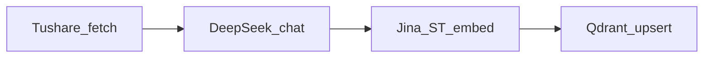

Docker安装
# 1. 拉取最新镜像
docker pull qdrant/qdrant:latest


# Qdrant 向量库（本地 Docker）

## 容器

```powershell
cd qdrant
docker compose up -d
```

- **Dashboard**：http://localhost:6333/dashboard  
- **REST**：6333；**gRPC**：6334  

### 常用命令

```powershell
docker logs -f qdrant
docker compose restart
docker compose down
```

若提示容器名 `/qdrant` 已被占用（以前 `docker run --name qdrant` 起的）：

```powershell
docker rm -f qdrant
docker compose up -d
```

### API Key

若 `docker-compose.yml` 里配置了 `QDRANT__SERVICE__API_KEY`，客户端需带同一密钥，例如：

```powershell
$env:QDRANT_API_KEY = "与 compose 一致的密钥"
python qdrant\test.py
```

未设置时，`test.py` 默认使用占位符 `your_strong_api_key_here`（与 compose 示例一致）。

---

## 新闻入库流水线（`ingest_news.py`）

### 端到端数据流



1. **Tushare**：多源 `news` / `major_news`，去重，`stable_id`（见 `news_fetch.py`）。  
2. **DeepSeek**：OpenAI 兼容 `POST .../chat/completions`，批量 JSON 抽取 `tickers` / `industry_tags` / `concept_tags`（见 `news_llm_tags.py`）。  
3. **向量（默认）**：本机 **sentence-transformers** + **`jinaai/jina-embeddings-v3`**，对标题+正文片段做 `encode`（见 `news_embed.py`）。  
4. **Qdrant**：建集合与 payload 索引、每批 upsert、可选按 `pub_ts` 删除早于 30 天的点。

默认集合名 **`financial_news`**（与 `test.py` 的 `news_collection` 分离，避免误删测试数据）。可通过 `QDRANT_COLLECTION` 覆盖。

**迁移提示**：若已有集合用其它嵌入模型/维度建过，换 Jina 后向量维度可能不一致，需**新 collection** 或清空重建。Jina v3 约 570M 参数，首次运行会从 Hugging Face 拉权重，并依赖 PyTorch 等，请预留磁盘与内存。

### 依赖

```powershell
pip install -r qdrant/requirements-ingest.txt
```

项目根目录已含 `pandas` / `tushare` 时，本文件补 **qdrant-client**、**httpx**、**sentence-transformers**（默认嵌入路径）。

### 环境变量一览

| 变量 | 说明 |
|------|------|
| `TUSHARE_TOKEN` | 必填，Tushare Pro token |
| `QDRANT_URL` | 默认 `http://localhost:6333` |
| `QDRANT_API_KEY` | 与 compose 中 API Key 一致（若启用） |
| `QDRANT_COLLECTION` | 默认 `financial_news` |
| `INGEST_UPSERT_BATCH_SIZE` | 默认 `500` |
| `INGEST_LOG_HTTP` | 设为 `1` / `true` 时恢复 **httpx/httpcore** 的 INFO 日志（默认压低，避免淹没流水线步骤） |

**打标（DeepSeek / OpenAI 兼容 Chat）**

| 变量 | 说明 |
|------|------|
| `NEWS_TAG_LLM_BASE_URL` | 默认 `https://api.deepseek.com/v1` |
| `NEWS_TAG_LLM_API_KEY` | 优先；否则读 `DEEPSEEK_API_KEY` 或 `OPENAI_API_KEY` |
| `NEWS_TAG_LLM_MODEL` | 默认 `deepseek-chat` |

**向量（默认：本机 Jina v3）**

| 变量 | 说明 |
|------|------|
| `NEWS_EMBED_BACKEND` | 默认 **`sentence_transformers`**（或 `st`）；设为 **`openai`** 时走下方「可选 HTTP 嵌入」 |
| `SENTENCE_TRANSFORMERS_MODEL` | 默认 **`jinaai/jina-embeddings-v3`** |
| `JINA_EMBED_TASK` | 仅 Jina v3：传给 `encode` 的 `task` / `prompt_name`，默认 **`retrieval.passage`**（入库文档向量；若改 Matryoshka `truncate_dim` 需与集合维度一致） |
| `JINA_EMBED_QUERY_TASK` | 仅 Jina v3：TradingAgents 从 Qdrant 检索 ④⑤ 时 `embed_query_texts` 使用，默认 **`retrieval.query`**（与 passage 向量做不对称检索） |
| `EMBEDDING_DIMENSIONS` / `NEWS_EMBED_DIM` | 占位默认 **`1024`**（与 Jina v3 默认输出一致）；若 `encode(..., truncate_dim=…)` 等则须与 Qdrant 集合维度一致 |

**可选：HTTP OpenAI 兼容嵌入（`NEWS_EMBED_BACKEND=openai`）**

用于 OpenAI 或任意兼容 `POST /v1/embeddings` 的网关；**不再**默认请求 DeepSeek 嵌入接口。

| 变量 | 说明 |
|------|------|
| `EMBEDDING_API_KEY` / `OPENAI_API_KEY` | 必填（该模式下） |
| `EMBEDDING_BASE_URL` | 默认 `https://api.openai.com/v1` |
| `EMBEDDING_MODEL` | 默认 `text-embedding-3-small` |
| `EMBEDDING_DIMENSIONS` / `NEWS_EMBED_DIM` | 与向量维一致；`text-embedding-3-*` 会尝试带 `dimensions` 参数 |
| `EMBEDDING_BATCH_INPUTS` | 每请求最多多少条文本，默认 `32` |

### 控制台日志

`ingest_news.py` 会打印带 **`[1/5]` … `[5/5]`** 的步骤与耗时；子模块会补充 Tushare 窗口、LLM 批次、向量后端、Qdrant upsert 等说明。

### 运行示例

```powershell
# 仅拉取 + 打标，不写库、不嵌入
python qdrant/ingest_news.py ingest --days 3 --dry-run

# 完整入库（需 Qdrant + 嵌入 + 打标密钥） --days 7 就是拉取最近7天的新闻
python qdrant/ingest_news.py ingest --days 7 

# 只执行「删除 pub_ts 早于 30 天」
python qdrant/ingest_news.py delete-only
```

### Payload 字段（便于过滤）

- `tickers`：`list[str]`，如 `600519.SH`  
- `industry_tags`、`concept_tags`：`list[str]`  
- `pub_ts`：Unix 秒，用于 TTL 删除  
- `pub_time`、`title`、`content`、`source`、`source_type`、`url`、`ingestion_date`

### 定时任务（Windows 任务计划 / cron）

每天固定时间执行，例如 07:00：

```powershell
cd C:\Users\黄勇\Desktop\TradingAgents
.\.venv\Scripts\python.exe qdrant\ingest_news.py ingest --days 31 --skip-delete
```

需要每日清理时去掉 `--skip-delete`。Linux cron 示例：

```cron
0 7 * * * cd /path/to/TradingAgents && .venv/bin/python qdrant/ingest_news.py ingest --days 31
```

### 与 `test.py` 的关系

- `test.py` 使用集合 **`news_collection`**（连通性测试）。  
- 入库脚本默认 **`financial_news`**；若需共用同一集合，设置 `QDRANT_COLLECTION=news_collection` 并保证 **向量维度与嵌入模型一致**。

### 更新镜像

```powershell
docker compose pull
docker compose up -d
```
